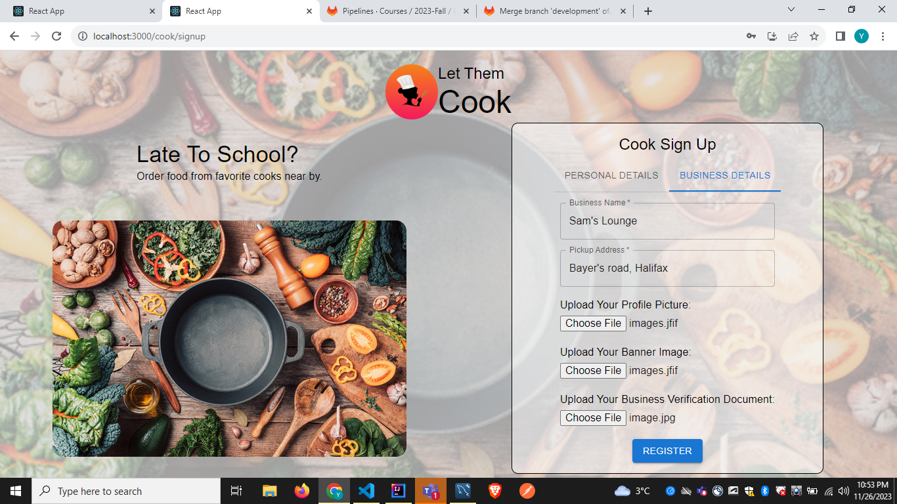

# Let Them Cook

#### Let them cook is created by students from Dalhousie University as part of the CSCI 5308 - Advanced Topics in Software Development (Fall 2023) course.

### Problem Statement:

In Canada, the scarcity of platforms offering tiffin services is a pervasive issue faced by numerous local and small-scale food businesses. This challenge often results in difficulty for customers hailing from various regions in finding these specialized food services. The struggle to locate tiffin services spans across different communities and contributes to the ongoing predicament faced by both businesses and consumers in the Canadian market.

### Our Solution

An innovative application tailored to enhance sales for local food businesses by offering a comprehensive platform. It serves as a unified space for advertising, order collection, and management. Users can set their meal schedules akin to a cook's routine and access in-depth analytics to bolster sales strategies. Whether opting for a one-time order or subscribing to meals, customers can conveniently view meal schedules and personalize their subscriptions within the platform.

### Test Case Coverage


## Build/deployment instructions

### Java instructions

- IntelliJ IDEA setup
  - In settings find Actions on Save and enable all options except build code
- To run the project
  - Make sure Mysql is running in the local system.
  - Make sure Gradle is installed in the system and environment variables are set
  - To run the project find a `LetscookApplication` class and run that as a Java application
  - Visit `localhost:8080` and check logs
- To run test cases
  - Move to the Java project root directory
  - run gradle task in verifaction `test`, this will run test cases and give results in the terminal

The deployed project can be accessed at https://let-them-cook.netlify.app/

### React instructions

This project is set up using create-react-app using javascript.

- https://create-react-app.dev/

#### Prerequisites

- [NodeJS](https://nodejs.org/en) `v20.x`

check if exists

```sh
node --version
npm --version
```

- Setup Project environment

  - download and setup npm
  - use npm to install dependencies for checked out project

Environment variables

- Create a .env file in react project root and have the following environment variables and change the value of variables as per your system

```
REACT_APP_PROD_API_BASE_PATH=${BACKEND_PROD_URL} 
REACT_APP_DEV_API_BASE_PATH=${BACKEND_LOCAL_URL}
REACT_APP_DEV_API_AUTH_USER_REGISTER=/register
REACT_APP_DEV_API_AUTH_USER_LOGIN=/login
REACT_APP_DEV_API_COOK_GET_ALL_COOKS=/cooks
REACT_APP_DEV_API_COOK_GET_COOK_BY_BUSINESSNAME=/cookSearch
REACT_APP_DEV_API_COOK_CREATE_PROFILE=/createProfile
REACT_APP_DEV_API_COOK_GET_ALL_PENDING_COOKS=/pendingCooks
REACT_APP_DEV_API_MENU_BASE_PATH=/menu
REACT_APP_DEV_API_MENU_BY_COOK=/cook
REACT_APP_DEV_API_MENU_CREATE_SCHEDULE=/createSchedule
REACT_APP_DEV_API_MENU_UPDATE_SCHEDULE=/updateSchedule
REACT_APP_DEV_API_MENU_DELETE_SCHEDULE=/deleteSchedule
REACT_APP_DEV_API_MENU_CREATE_DISH=/createDish
REACT_APP_DEV_API_MENU_UPDATE_DISH=/updateDish
REACT_APP_DEV_API_MENU_DELETE_DISH=/deleteDish
REACT_APP_DEV_API_MENU_ADD_DISH_TO_MEAL=/addDishToMeal
REACT_APP_DEV_API_MENU_ADD_MEAL_TO_SCHEDULE=/addMealToSchedule
REACT_APP_DEV_API_MENU_UPDATE_MEAL_TO_SCHEDULE=/updateMealToSchedule
REACT_APP_DEV_API_MENU_DELETE_MEAL=/deleteMeal
REACT_APP_DEV_API_MENU_GET_DISHES_BY_COOK=/getDishes
REACT_APP_DEV_API_MENU_GET_DISHES_BY_MEAL=/getDishesByMeal
REACT_APP_DEV_API_MENU_BY_MEAL=/meal
REACT_APP_DEV_API_ORDER_PAYMENT=/payment
REACT_APP_DEV_API_ORDER=/orders
REACT_APP_DEV_API_CREATE_ORDER=/createOrder
REACT_APP_DEV_API_ORDER_BY_CUSTOMER_ID=/customer
```

- To run the project
  - first run `cd <Project_directory>/Frontend/let-them-cook` it will move you to frontend project's root directory
  - first run `npm install` from the react project root directory
  - then run `npm run start` to start the project


## Dependencies

### Frameworks and Tools used

| Dependency Name | Version | Description |
| --- | --- | --- |
| [VS Code](https://code.visualstudio.com/) | 1.84 | A code editing platform that offers a wide range of features for software development, including code completion, debugging, and version control. |
| [Intellij idea](https://www.jetbrains.com/idea/) | 2023.1 | A powerful integrated development environment (IDE) for Java, Kotlin, and other languages, offering a wide range of features for software development, including code completion, debugging, and version control. |
| [MySQL](https://www.mysql.com/products/workbench/) | 8.0 | A popular open-source relational database management system (RDBMS) used for storing, manipulating, and retrieving data in various formats. |
| [Postman](https://www.postman.com/downloads/) | 8.13.0 | A tool for testing, building, and troubleshooting APIs, offering a wide range of features such as API request builders, response analyzers, and collaboration tools. |
| [Gradle](https://gradle.org/install/) | 3.8.1 | An open-source build automation tool used for managing and building software projects, offering a wide range of features such as dependency management, project management, and build automation. |
| [Java 17](https://openjdk.org/projects/jdk/17/) | 17.0 | A version of the Java programming language and runtime environment, offering a wide range of features such as improved performance, security, and compatibility. |
| [Node JS](https://nodejs.org/en) | 14.17.0 | A JavaScript runtime built on Chrome's V8 JavaScript engine, used for developing scalable, high-performance applications, offering a wide range of features such as event-driven programming, non-blocking I/O, and a vast ecosystem of packages. |

### React Dependencies

The following is a list of necessary dependencies for building this React application using TypeScript and Vite.

| Name | Version | Description |
| --- | --- | --- |
| @babel/plugin-proposal-private-property-in-object | ^7.21.11 | This plugin transforms checks for a private property in an object. |
| @emotion/react | ^11.11.1 | A library for simple styling in react. |
| @emotion/styled | ^11.11.0 | A style API for @emotion/react. |
| @mui/icons-material | ^5.14.15 | This package provides the Google Material Icons converted to SvgIcon components. |
| @mui/material | ^5.14.13 | It is a comprehensive library of components that features our implementation of Google's Material Design system. |
| @reduxjs/toolkit | ^1.9.7 | It is official, opinionated, batteries-included toolset for efficient Redux development.  |
| @testing-library/jest-dom | ^5.17.0 | It is a custom jest matchers to test the state of the DOM. |
| @testing-library/react | ^13.4.0 | A library for simple and complete React DOM testing utilities that encourage good testing practices. |
| @testing-library/user-event | ^13.5.0 | Fire events same way the user does. |
| axios | ^1.6.2 | A library for doing api calls. |
| firebase | ^10.6.0 | A library used for storing images. |
| moment | ^2.29.4 | A library for handling date and time in javascript. |
| react | ^18.2.0 | A JavaScript library for building user interfaces. |
| react-dom | ^18.2.0 | A library for rendering React components to the DOM. |
| react-router-dom | ^6.16.0 | A library for handling client-side routing in React applications. |
| react-scripts | 5.0.1 | This package includes scripts and configuration for create react app. |
| react-stripe-checkout | ^2.6.3 | A library for integrating payment using stripe. |
| react-toastify | ^9.1.3 | A library for displaying toast notifications in React applications. |
| uuid | ^9.0.1 | A library for creating uuids. |
| web-vitals | ^2.1.4 | A library for measuring all the Web Vitals metrics on real users, in a way that accurately matches how they're measured by Chrome and reported to other Google tools.  |

These dependencies are required for building and running the application. The development dependencies are used during development and testing.


### Spring Boot Dependencies

| Dependency Name | Version | Short Description |
| --- | --- | --- |
| spring-boot-starter-data-jpa | 3.1.4 | Spring Boot starter for JsPA |
| spring-boot-starter-security | 3.1.4 | Spring Boot starter for security |
| spring-boot-starter-oauth2-resource-server | 3.1.4 | Spring Boot starter for validation |
| spring-boot-starter-web | 3.1.4 | Spring Boot starter for web |
| spring-boot-starter-mail | 3.1.4 | Spring Boot starter for web |
| stripe-java | 24.3.0 | Stripe sdk for payment integration |
| mysql-connector-java | 8.0.28 | MySQL connector for Java |
| spring-boot-starter-test | 3.1.4 | Spring Boot starter for testing |
| lombok | 5.7.1 | Lombok dependency for getter setter |
| junit-jupiter-api | 5.8.1 | junit jupiter for unit testing in java |

### Continuous Integration and Continuous Deployment
The application employs a multi-stage approach for code development, testing, deployment, and code quality analysis of modified files. 
We have expanded our CI/CD pipeline by adding extra stages to bolster our capabilities, ensuring thorough checks for code quality. 
The CI/CD uses a custom runner tagged using development for running the pipeline.
Here is an overview of the various CI/CD stages:

- npm test: Executes all the frontend tests using Karma Unit Tests for React files in the VM Server.
- npm build: Compiles the frontend package into main.js and vendor.js files of both es2015 and es2020 versions.
- npm deploy: Deploys the packaged JS files to the NETLIFY server at https://let-them-cook.netlify.app/.
- test: Verifies if the code aligns with the code quality gate guidelines on the GitLab Server.
- build: Utilizes the Designite tool via a jar file on the GitLab Server to analyze the code.
- issue: Applies the Designite tool to the application's backend code.
- publish: Uses the Gradle build to construct the backend of the application.
- gradle test: Runs all backend tests within the GitLab Server.
- deploy: Deploys the backend code to the Dal VM Server, accessible at http://os-vm173.research.cs.dal.ca/.

### Smells
The code repository shows minimal issues flagged by the Designite code quality tool, with the majority of identified problems already resolved. 
The remaining detected issues are considered False Positives because altering that code might impact the overall syntax and functionality. 
Exhaustive analysis has effectively tackled Architecture and Implementation concerns, resolving them at an impressive rate of 99%.

### Code Quality
Our team has prioritized top-notch code quality while steadfastly upholding functionality. Our coding approach adheres to specific principles, guaranteeing:

- Singular Responsibility
- Open/Closed Principle
- Liskov Substitution

These principles form the foundation upon which our code is built, ensuring both quality and robust functionality.


## Usage Scenarios for Let Them Cook

### Introduction

#### Landing Page

- Upon visiting Let Them Cook, users are presented with options to `Log In` or `Sign Up`.


#### Authentication

##### Log In

- Existing users enter their credentials to access their accounts. Based on their roles they will be directed to their respective dashboard.


##### Sign Up

- New users navigate to the `Sign Up Page` and complete `User Registration` to create an account.


- User has create their profile which requires name, phone number. For cook it requires few more things like profile picture, banner image and business documents.



#### Admin Dashboard

- Admin can see the cooks that has verfication pending and they can verify by seeing their business documents


#### Cook Dashboard

- Once authenticated, the cook is directed to the landing page. The dashboard will have create schedule, create dish, create meal options and will see the schedules, dishes, and meals they have added.


#### Update Profile

- Users can update their personal details such as name, email, profile picture, banner image, phone number and business document under certain condition.


### Screens for cook menu management

- cooks select `Add dish` to add new dish.


- cooks can edit dish the dish they have created.


- Cooks can add the dish to meal by clicking on `Add meal`.


- Cooks can edit the meal they have created, they can edit name, price and other parameters.


- Cooks can create a schedule which customer will see and order from it.


### Screens for cook order management

- Cooks can see the orders they received and change the status of it.


### Customer Dashboard 

- Customer will get to see all the cooks available as a list and can order a meal from their schedule.


### Screens for customers ordering meal

- Customers can order a single meal or get a subscription for a week from the cook they selected and proceed to checkout.


- Afterwards, in checkout customer will see amout to pay and details.


- On clicking `pay` user will bee redirected to page where they add card details and pay the amount and upon successful payment order will be placed.


## Conclusion

This provides the steps a Customer and Cook will follow on the Let them Cook service, ensuring a clear path from sign-up to placing order or delivering order.

## Credits

### Development team:

1. Nikunj Lalitkumar Hudka (B00959783)
2. Yash Khorja (B00957065)
3. Parth Rajendra Kharkhanis (B00959176)
4. Sanjana Rampur Kottur (B00957180)

### Client team:

1. Aniket Mhatre (B00969798)
2. Prithvi Manoj Krishna (B00961642)
3. Rabia Asif (B00931734)
4. Vivek Alpeshbhai Sonani (B00953064)
5. Smit Patel (B00963945)

Course Instructor: [Dr. Tushar Sharma](https://tusharma.in)
